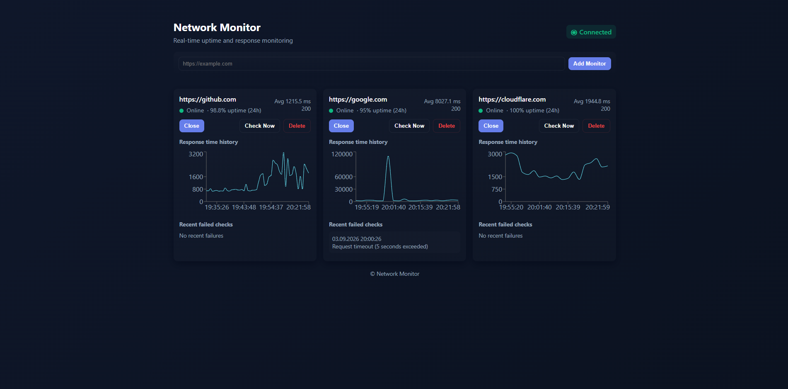

# Network Monitor

A full-stack uptime and response-time monitoring dashboard built with FastAPI, React, TypeScript, and SQLite.

The application periodically checks HTTP/HTTPS targets, stores monitoring history, calculates uptime statistics, and visualizes response-time trends.



## Features

- Add and remove HTTP/HTTPS monitoring targets
- Automatic health checks every 60 seconds
- Manual health checks with **Check Now**
- Online/offline status tracking
- HTTP status code monitoring
- Response-time measurement
- 24-hour uptime calculation
- Average response-time statistics
- Monitoring history stored in SQLite
- Response-time charts
- Recent failure history
- Responsive dark-mode dashboard
- Backend connection status indicator

## Tech Stack

### Backend

- Python
- FastAPI
- SQLAlchemy
- SQLite
- APScheduler
- HTTPX
- Pydantic

### Frontend

- React
- TypeScript
- Vite
- Axios
- Recharts

### Testing

- Pytest
- FastAPI TestClient
- Mocked HTTP requests for deterministic tests

## Architecture

```text
React Dashboard
      |
      | REST API
      v
FastAPI Backend
      |
      +---- HTTPX ----> Monitored Websites
      |
      +---- APScheduler
      |        |
      |        +---- Automatic checks every 60 seconds
      |
      +---- SQLAlchemy
               |
               v
             SQLite
       Targets + Check History
```

## API Endpoints

| Method | Endpoint                | Description                             |
| ------ | ----------------------- | --------------------------------------- |
| GET    | `/health`               | Check backend availability              |
| POST   | `/check`                | Perform a one-time URL check            |
| POST   | `/targets`              | Add a monitoring target                 |
| GET    | `/targets`              | List monitoring targets                 |
| DELETE | `/targets/{id}`         | Delete a monitoring target              |
| POST   | `/targets/{id}/check`   | Check a target immediately              |
| GET    | `/targets/{id}/history` | Retrieve recent monitoring history      |
| GET    | `/targets/{id}/stats`   | Retrieve uptime and response statistics |

## Running Locally

### 1. Clone the repository

```bash
git clone https://github.com/Nur967/network-monitor.git
cd network-monitor
```

### 2. Start the backend

Install the Python dependencies:

```bash
python -m pip install -r backend/requirements.txt
```

Start the API:

```bash
cd backend
python main.py
```

The backend will run at:

```text
http://localhost:8000
```

### 3. Start the frontend

Open another terminal:

```bash
cd frontend
npm install
npm run dev
```

Open the application at:

```text
http://localhost:5173
```

## How It Works

1. A user adds an HTTP or HTTPS URL to the monitoring dashboard.
2. FastAPI stores the monitoring target in SQLite.
3. APScheduler checks saved targets every 60 seconds.
4. HTTPX measures availability, HTTP status code, and response time.
5. Each check result is stored in the monitoring history.
6. The backend calculates uptime percentage and average response time.
7. React displays live status information and historical response-time data.

## Testing

Run the backend test suite with:

```bash
cd backend
pytest
```

The tests cover:

- URL validation
- HTTP health checks
- Connection failures and timeouts
- Database persistence
- Monitoring target management
- Monitoring history
- Uptime calculations
- Response-time statistics
- Scheduled monitoring logic

## Project Status

**MVP complete.**

### Possible Future Improvements

- Email or Discord downtime notifications
- Configurable monitoring intervals
- PostgreSQL / TimescaleDB support
- User authentication
- Docker deployment
- GitHub Actions CI/CD
